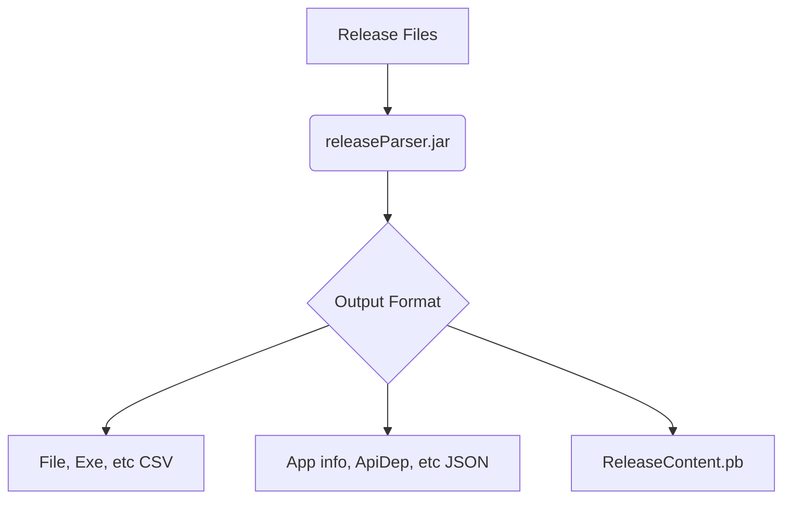

# ReleaseParser

A tool for parsing Android release files, forked from [android/cts/releaseparser](https://android.googlesource.com/platform/cts/+/main/tools/release-parser). By unbundling it from the huge Android code tree, it's easier to build and experiment.

## Description

This project provides a command-line tool to parse Android release files, such as device builds, test suites, and app distribution packages. It extracts information like executable lists, service lists, permissions, properties, and file lists, and outputs them into CSV, JSON, and protobuf formats.

## System Architecture



## Local Build

* Open `releaseParserProj` via Android Studio.
* Open `build.gradle.kts` to build uberJar. This will create a `releaseParser.jar` file in the `releaseParserProj/build/libs` directory.

## Usage

To use the tool, run the following command:

```bash
java -jar build/libs/releaseParser.jar -i <path_to_release_folder> -o <path_to_output_folder>
```

For example, see [releaseParser.sh](./releaseParser.sh).

### Options

* `-i PATH`: Path to the release folder to parse.
* `-o PATH`: Path to the directory where output files will be saved.
* `-f Filter1,Filter2`: A comma-separated list of filters to apply.

## Testing

[test.sh](./test.sh) parses the files in [releaseParserSrc/tests/resources](./releaseParserSrc/tests/resources) to generate results in `../tmp/testReleaseParser`.

## Dependencies

This project utilizes local JARs located in the [libs](./libs) folder:

* `smali.jar`: Smali/Baksmali disassembler/assembler library.
* **From `android-cts/tools`:**
  * `compatibility-host-util.jar`: Utility library for host compatibility.
  * `hosttestlib.jar`: Library for host-side testing.
  * `tradefed.jar`: Trade Federation test harness library.
